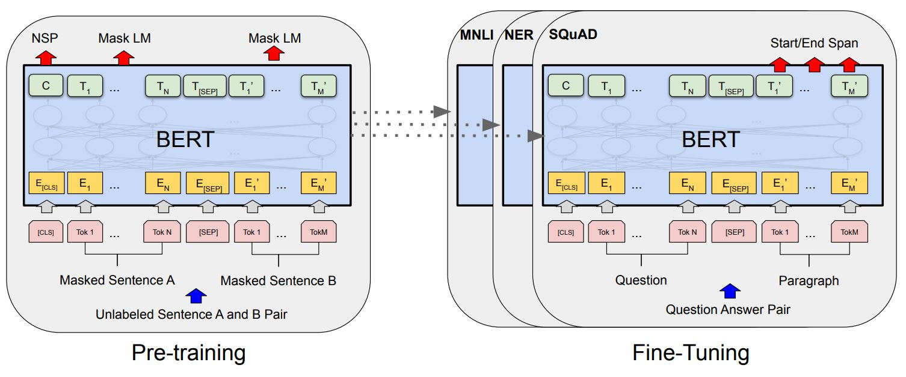
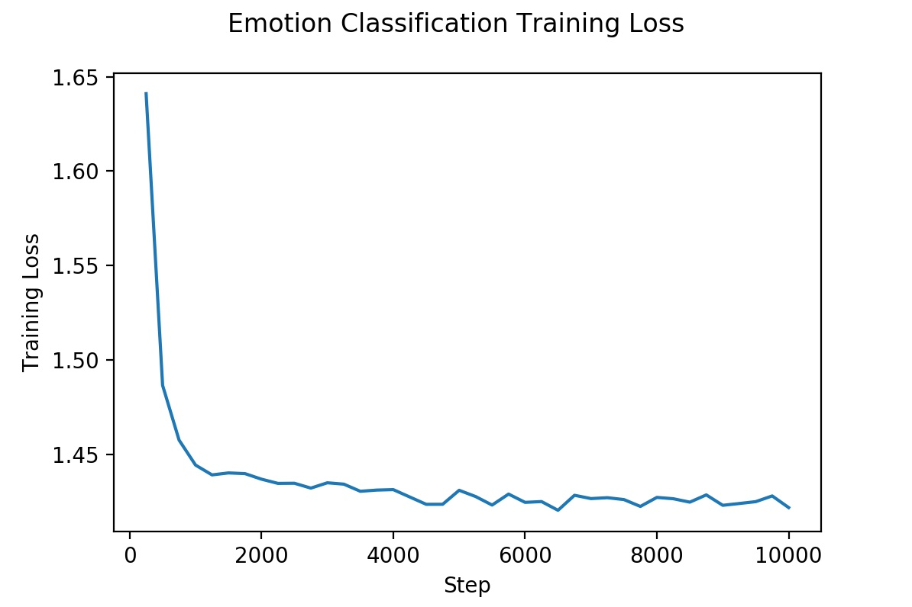
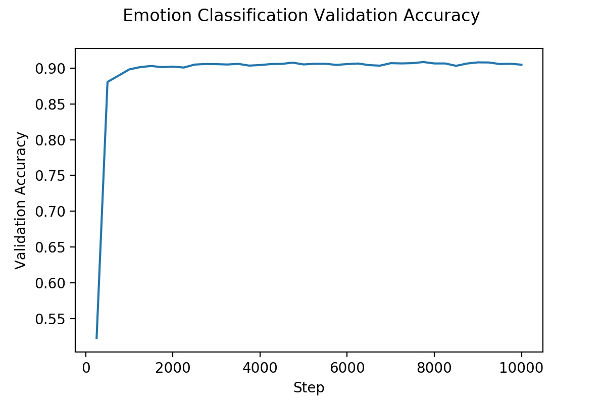

# Bidirectional Encoder Representations from Transformers
This repository contains an implementation of [Bidirectional Encoder Representations from Transformers](https://arxiv.org/abs/1810.04805v2), with the architecture of BERT shown in Fig. 1. 



## Training and Validation Progress
The model is trained on a an [emotional classification dataset](https://github.com/dair-ai/emotion_dataset) and the [YELP polarity dataset](https://course.fast.ai/datasets). For the former, run
```
python train_bert_emotion_classifier.py
```
to train the emotion classification model and run
```
python infer_bert_emotion_classifier.py
```
to perform inference. 

For the YELP polarity dataset, run
```
python process_yelp_tokens_bert.py
```
to learn the vocabulary and format the data, followed by
```
python yelp_reviews_tf_ver2_bert.py
```
to train the BERT polarity classifier. Please note that this implementation trains the model from scratch using the labelled data and no fine-tuning or transfer learning is performed.

## Training and Validation Progress of the Emotion Classification Model
The plots below show the training and validation progress of the model.
| Training Loss | Validation Accuracy |
| ------------- | ------------------- |
|  |  |

## Evaluation Metrics
The final evaluation on the validation dataset of the emotion classification model is as follows:
```
              precision    recall  f1-score   support

           0       0.92      0.89      0.91     14320
           1       0.85      0.89      0.87     11949
           2       0.91      0.95      0.93     35285
           3       0.87      0.73      0.79      8724
           4       0.93      0.94      0.94     30161
           5       0.83      0.71      0.77      3764

    accuracy                           0.90    104203
   macro avg       0.89      0.85      0.87    104203
weighted avg       0.90      0.90      0.90    104203
```

For the YELP polarity model, the evaluation on the validation dataset is as follows:
```
              precision    recall  f1-score   support

           0       0.92      0.93      0.93     19000
           1       0.93      0.92      0.93     18999

    accuracy                           0.93     37999
   macro avg       0.93      0.93      0.93     37999
weighted avg       0.93      0.93      0.93     37999
```

