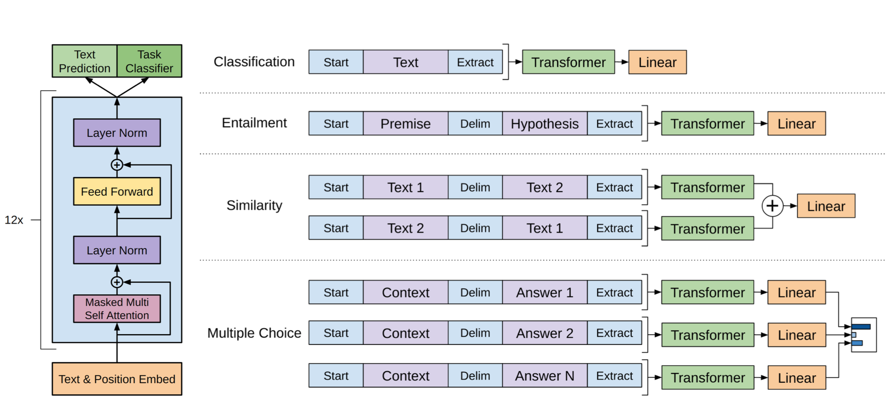

# NLP Generative Pre-Training (GPT) Model
This repository includes the codes that I have modified for the GPT model, following the publication of [Open AI's GPT Model](https://openai.com/blog/better-language-models/). In particular, the changes include (i) the addition of a learnt positional embedding vector in each layer and (ii) the addition of a residual connection between the input embedding and the output embedding layer.



Fig. 1: GPT Model Architecture (obtained from [GPT paper](https://cdn.openai.com/research-covers/language-unsupervised/language_understanding_paper.pdf))

This repository includes a code to train the data on the [Movie Dialogue](https://www.cs.cornell.edu/~cristian/Cornell_Movie-Dialogs_Corpus.html) dataset, where the preparation of the data follows this [script](https://github.com/suriyadeepan/datasets/blob/master/seq2seq/cornell_movie_corpus/scripts/prepare_data.py) closely. Instead of using a Sequence-to-Sequence model, the dialogue GPT model performs its inference by conditioning on the encoder inputs, followed by the `SOS` token to signal the beginning of the decoder output. For this model, the vocabulary is shared so the token embeddings are the same for both the encoder and decoder.

Before training the model, first process the data by running
```
python process_movie_dialogue.py
```
to use word tokens, or 
```
python process_movie_dialogue_subword.py
```
to use sub-word tokens, followed by
```
python movie_dialogue_tf_ver2_gpt.py
```
to train the GPT model. Run the script
```
python movie_dialogue_tf_ver2_gpt_test.py
```
to perform inference.

For the movie dialogue dataset, the training is done in the following manner - the encoder input is first inserted, followed by the `SOS` token, followed by the decoder output and finally ending with the `EOS` token. For example, if we have
```
Input Phrase:
how are you ?
Output Phrase:
SOS i ' m fine . EOS
```
as the encoder-decoder training pair, the GPT model will transform the encoder and decoder responses into
```
how are you ? SOS i ' m fine . EOS
```
and train the model on the concatenated response. Using the same example, inference is done by setting the seed as the encoder input followed by the `SOS` token, or
```
how are you ? SOS
```
and for illustration purposes, if the GPT model's prediction of the entire sequence is
```
how are you ? SOS i am feeling fine . EOS
```
the decoder response will be taken as the GPT model's prediction following the `SOS` token, which is `i am feeling fine . EOS`.

The GPT model is also trained on the [Reddit Jokes dataset](https://github.com/taivop/joke-dataset). The jokes dataset is conditioned on the score of the data - `bad_joke` denotes jokes with a score less than or equal to 12, `ok_joke` denotes jokes which have a score between 12 and 50 and `good_joke` are jokes which have a score greater than or equal to 50. For the Reddit jokes dataset, run
```
python process_reddit_jokes.py
python reddit_jokes_tf_ver2_gpt.py
```
to train the model on word tokens, or
```
python process_reddit_jokes_subword.py
python reddit_jokes_subword_tf_ver2_gpt.py
```
to train the model on sub-word tokens. To perform inference, run
```
python reddit_jokes_tf_ver2_gpt_test.py
```
for word tokens, or
```
python reddit_jokes_subword_tf_ver2_gpt_test.py
```
for sub-word tokens.

## Outputs
The GPT model on the movie dialogue dataset using a Nvidia Quadro P1000 4GB Graphics Card for 20000 iterations. Below are some sample outputs.
```
Input Phrase:
hello
Generated Response:
hi EOS PAD PAD PAD PAD PAD PAD PAD PAD PAD PAD PAD PAD PAD PAD PAD PAD PAD PAD

Input Phrase:
how much does it cost
Generated Response:
thirty dollars EOS PAD PAD PAD PAD PAD PAD PAD PAD PAD PAD PAD PAD PAD

Input Phrase:
who is it
Generated Response:
it s me rock EOS PAD PAD PAD PAD PAD PAD PAD PAD PAD PAD PAD PAD PAD
```

### PyTorch Support
The relevant modules have been written using PyTorch as well. Run
```
python movie_dialogue_torch_gpt.py
```
to train the model using the PyTorch library. For inference, run
```
python movie_dialogue_torch_gpt_test.py
```
The data is pre-processed in the same manner as its Tensorflow counterpart, but it is worth noting that the PyTorch code uses the Weighted Adam Optimizer `AdamW` and not the Adam optimizer.

## Trained Models
Some of the trained models can be downloaded via:

| Model Name | Link |
| ---------- | ---- |
| PyTorch Dialogue Word GPT | https://github.com/WD-Leong/NLP-Transformer/releases/download/v0.9/dialogue_transformer_gpt |
| TensorFlow v2 Sub-word GPT | https://github.com/WD-Leong/NLP-Transformer/releases/download/v0.9/dialogue_subword_gpt.zip |

The data sets can be downloaded at:

| Data Type | Link |
| --------- | ---- |
| Movie Dialogue Word Data | https://github.com/WD-Leong/NLP-Transformer/releases/download/v0.9/movie_dialogues.pkl |
| Movie Dialogue Sub-word Data | https://github.com/WD-Leong/NLP-Transformer/releases/download/v0.9/movie_dialogues_subword.pkl |
